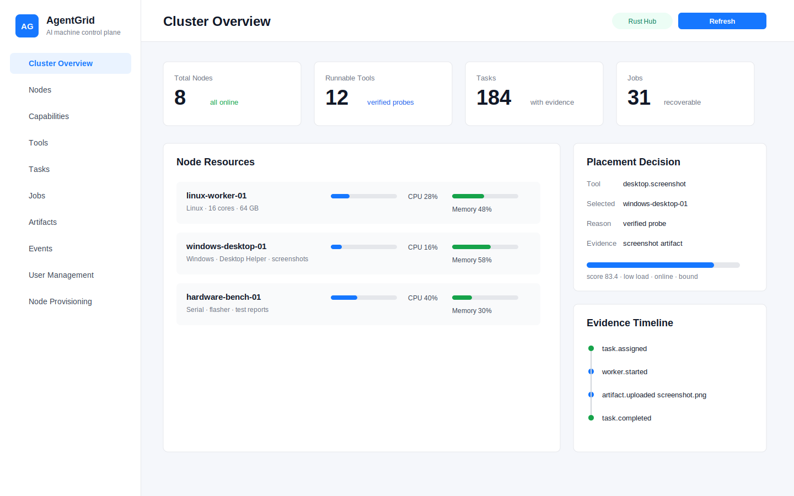

# AgentGrid

[English](README.md) | [愿景](docs/zh-CN/vision.md) | [5 分钟快速开始](docs/zh-CN/quickstart.md) | [安装](docs/zh-CN/install.md) | [部署](docs/zh-CN/deployment.md) | [命令](docs/zh-CN/cli.md) | [发布](docs/zh-CN/release.md)

AgentGrid 是一个开源的 AI 真实机器调度层：让 AI 客户端可以发现机器、选择节点、调用工具、操作桌面/工位、执行任务，并拿回可审计的证据。

它不负责自然语言理解。自然语言规划是大模型和 AI 客户端的事情；AgentGrid 负责底层标准化运行时：能力发现、资源感知调度、Worker 执行、任务产物、审计事件和可恢复 Job。



## 为什么做 AgentGrid

AI 越来越会写代码、规划任务、调用工具，但真实业务里很多动作仍然发生在真实电脑和真实设备上：

- Windows 工装机和只支持桌面的软件
- Linux 构建节点、内网服务器、私有环境
- 浏览器工位、SDK 工位、公司内部工具
- 硬件测试台、串口、烧录器、测试治具
- 截图、日志、文件、测试报告、DOM、串口输出等证据

AgentGrid 的目标是把这些真实机器变成一个可发现、可调度、可审计的能力网络。

## 核心概念

- **Hub**：中心控制面，管理组织、用户、节点、任务、Job、工具、产物、事件和总控台。
- **Worker**：运行在 Linux、macOS、Windows 上的 Rust 节点代理。
- **能力图谱**：节点 -> 设备 -> 工具 -> 插件 -> Probe -> 证据 -> 适合的任务。
- **调度引擎**：按硬约束、软评分、资源负载、Probe 状态、历史成功率和风险选择节点。
- **证据流水线**：任务结果统一回写 stdout/stderr、截图、文件、日志、报告、时间线。
- **Job Runtime**：支持 lease、checkpoint、分片、重调度、reducer 和恢复扫描。
- **AgentMessage**：AI 员工/Agent 之间的结构化协作消息。
- **MCP + SDK**：给 AI 客户端和人类开发者的标准接入面。

## 生态愿景

AgentGrid 不是一个孤立的软件，而是一个生态底座：

- 插件可以扩展节点能力
- 任务模板可以沉淀常用操作
- 工位 Runbook 可以服务硬件测试、桌面操作、浏览器自动化
- SDK 可以接入 Rust、Node、Python、iOS、Android 和更多客户端
- MCP Server 可以让 Codex、Claude、Cursor 等 AI 客户端标准调用 AgentGrid

像 [Open Design](https://open-design.ai/zh/) 这类 Skill / 本地优先 / BYOK / 设计系统项目，可以和 AgentGrid 很好结合：Open Design 的 Skill 或设计工作流可以成为 AgentGrid 的 Tool/Plugin，而 AgentGrid 提供真实机器调度、桌面执行、产物回传和审计证据。

## 当前能力

- Ant Design Pro 总控台
- 节点在线/离线、CPU 核心、内存、硬盘、OS、IP、心跳展示
- 节点入网授权：机器码 + join token + 管理员确认
- HTTP、命令、文件、Git、Docker、浏览器、桌面、插件、AgentMessage 任务
- Windows Desktop Helper：截图、点击、输入、按键
- 任务详情、执行日志、截图、文件产物、审计记录
- 队列、优先级、目标节点/系统调度、调度原因说明
- Job Runtime：Dry Run、分片、checkpoint、恢复扫描、reducer
- Tool Registry、Node Tools、Tool Probe、Capability Manifest
- Webhook、Event Bus、执行档案、审计日志
- MCP Server 和 SDK
- OpenAPI + JSON Schema 标准

## 快速开始

安装最新 Release：

```bash
curl -fsSL https://raw.githubusercontent.com/hanfeihu/agentgrid/main/scripts/install.sh | bash
```

Windows PowerShell，用管理员权限运行：

```powershell
irm "https://raw.githubusercontent.com/hanfeihu/agentgrid/main/scripts/install.ps1" | iex
```

然后启动一个本地 Hub、一个本地 Worker，并提交一个命令任务：

```bash
agentgrid-hub --host 127.0.0.1 --port 20181 --db /opt/agentgrid/agentgrid-hub.db --web-dir /opt/agentgrid/web
agentgrid-worker --hub http://127.0.0.1:20181 --id local-worker --name "Local Worker" --capability command --capability file --capability http
agentgrid submit-command --program hostname --wait
```

完整步骤见 [5 分钟快速开始](docs/zh-CN/quickstart.md)。

从源码构建需要：

- Rust stable
- Node.js 20+

构建检查：

```bash
cargo check -p agentgrid-hub -p agentgrid-worker-app -p agentgrid-cli -p agentgrid-mcp
npm --prefix apps/agentgrid-web install
npm --prefix apps/agentgrid-web run build
```

启动 Hub：

```bash
cargo run -p agentgrid-hub -- \
  --host 127.0.0.1 \
  --port 20181 \
  --db data/agentgrid-hub.db \
  --web-dir apps/agentgrid-web/dist
```

启动 Worker：

```bash
cargo run -p agentgrid-worker-app -- \
  --hub http://127.0.0.1:20181 \
  --id local-worker \
  --name "Local Worker" \
  --capability command \
  --capability file \
  --capability http
```

打开总控台：

```text
http://127.0.0.1:20181
```

提交命令任务：

```bash
cargo run -p agentgrid-cli -- submit-command \
  --program hostname \
  --wait
```

## 文档

| 主题 | 中文 | English |
| --- | --- | --- |
| 5 分钟快速开始 | [docs/zh-CN/quickstart.md](docs/zh-CN/quickstart.md) | [docs/quickstart.md](docs/quickstart.md) |
| 愿景和生态 | [docs/zh-CN/vision.md](docs/zh-CN/vision.md) | [docs/vision.md](docs/vision.md) |
| 架构 | [docs/zh-CN/architecture.md](docs/zh-CN/architecture.md) | [docs/architecture.md](docs/architecture.md) |
| 安装 | [docs/zh-CN/install.md](docs/zh-CN/install.md) | [docs/install.md](docs/install.md) |
| 部署 | [docs/zh-CN/deployment.md](docs/zh-CN/deployment.md) | [docs/deployment.md](docs/deployment.md) |
| 命令 | [docs/zh-CN/cli.md](docs/zh-CN/cli.md) | [docs/cli.md](docs/cli.md) |
| 节点入网 | [docs/zh-CN/node-join.md](docs/zh-CN/node-join.md) | [docs/node-join-standard.md](docs/node-join-standard.md) |
| 产物 | [docs/zh-CN/artifacts.md](docs/zh-CN/artifacts.md) | [docs/artifacts.md](docs/artifacts.md) |
| 发布流程 | [docs/zh-CN/release.md](docs/zh-CN/release.md) | [docs/release.md](docs/release.md) |
| OpenAPI | [docs/openapi/agentgrid-openapi.yaml](docs/openapi/agentgrid-openapi.yaml) | Same |
| 命令参考 | [docs/agentgrid-command-reference.md](docs/agentgrid-command-reference.md) | Same |

## 安全提示

AgentGrid 可以在你拥有或管理的机器上执行命令、读写文件、操作桌面。生产环境不要裸露 Hub，必须配置认证、网络控制和操作策略。SMTP 授权码、SSH 密码、私钥、生产服务器清单不要提交到 git。

## License

AgentGrid 使用 Apache License 2.0 开源。见 [LICENSE](LICENSE)、[NOTICE](NOTICE)、[OPEN_SOURCE.md](OPEN_SOURCE.md)。
