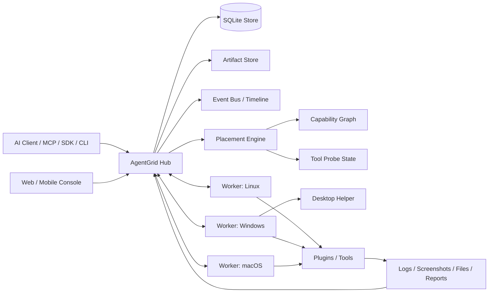

# AgentGrid Architecture

AgentGrid is a Hub-and-Worker runtime for AI-operated real machines.

The Hub owns cluster state, placement decisions, jobs, tasks, artifacts, users, organizations, tools, and audit events. Workers run on machines that can execute real operations. AI clients, CLIs, SDKs, MCP servers, and web/mobile consoles talk to the Hub through structured APIs.

## High-Level Diagram

## Runtime Flow

1. An AI client discovers capabilities through `GET /api/capabilities/manifest`.
2. The client submits a structured task or Job.
3. The Hub validates the payload and builds a placement contract.
4. The Placement Engine filters nodes by hard constraints.
5. Eligible nodes are scored by resource load, concurrency, probe status, history, weight, and risk.
6. A Worker leases the task or receives work through the runtime contract.
7. The Worker executes a built-in task type or a plugin tool.
8. Output, evidence, artifacts, metrics, and audit events are written back to the Hub.
9. The Web console, CLI, SDK, MCP server, webhooks, and event streams observe the same state.

## Core Modules

| Module | Responsibility |
| --- | --- |
| `apps/agentgrid-hub` | Rust HTTP Hub, store, API, console hosting, runtime loops |
| `apps/agentgrid-worker` | Cross-platform Worker, task execution, heartbeats, artifacts |
| `apps/agentgrid-cli` | Human and AI-friendly command line |
| `apps/agentgrid-mcp` | Model Context Protocol server |
| `apps/agentgrid-web` | Ant Design Pro web console |
| `crates/agentgrid-protocol` | Shared protocol types |
| `crates/agentgrid-scheduler` | Scoring and placement helpers |
| `crates/agentgrid-sdk` | Rust SDK client |
| `sdk/node` | Node.js SDK |
| `sdk/python` | Python SDK |
| `sdk/mobile` | iOS and Android console SDK standards |

## Important Standards

- AgentMessage: structured collaboration between AI agents.
- AgentTask: structured task contract.
- Capability Graph: relation model for nodes, tools, devices, plugins, probes, and evidence.
- Execution Contract: input, output, errors, timeout, retryability, artifacts, audit, and metrics.
- Evidence Pipeline: screenshots, logs, files, test reports, serial output, DOM snapshots, and timelines.
- Node Join: machine fingerprint + join token + Hub approval.
- Job Runtime: lease, checkpoint, shard, reducer, and recovery semantics.

## What AgentGrid Does Not Do

- It does not parse natural-language instructions into actions.
- It does not replace AI clients.
- It does not try to be a generic RDP, Jenkins, Ansible, or CI replacement.
- It does not assume every node has the same capabilities.

AgentGrid is the structured runtime under those systems: the part that knows what real machines can do, where a task should run, what evidence came back, and what happened over time.

