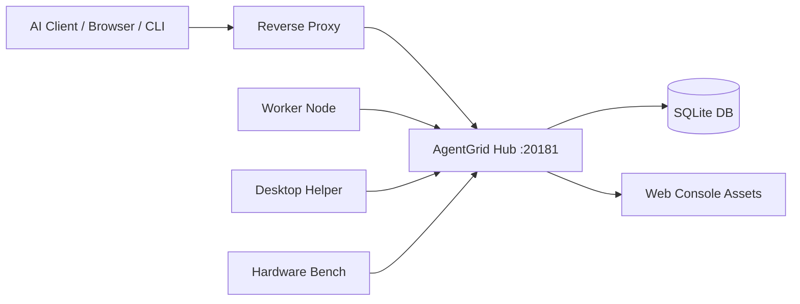

# Deployment

This guide describes a simple production-style AgentGrid Hub deployment.

## Recommended Topology



Workers connect outward to the Hub. Worker nodes do not need inbound public ports.

## Build Release Binaries

```bash
cargo build --release -p agentgrid-hub -p agentgrid-worker -p agentgrid-cli -p agentgrid-mcp
npm --prefix apps/agentgrid-web install
npm --prefix apps/agentgrid-web run build
```

## Hub Directory Layout

```text
/opt/agentgrid-hub/
├── bin/
│   └── agentgrid-hub
├── data/
│   └── agentgrid-hub.db
├── web/
│   ├── index.html
│   └── assets/
└── downloads/
    └── linux-x86_64/
```

## Start Hub

```bash
/opt/agentgrid-hub/bin/agentgrid-hub \
  --host 127.0.0.1 \
  --port 20181 \
  --db /opt/agentgrid-hub/data/agentgrid-hub.db \
  --web-dir /opt/agentgrid-hub/web
```

## systemd Unit

Example:

```ini
[Unit]
Description=AgentGrid Hub
After=network-online.target
Wants=network-online.target

[Service]
Type=simple
WorkingDirectory=/opt/agentgrid-hub
ExecStart=/opt/agentgrid-hub/bin/agentgrid-hub --host 127.0.0.1 --port 20181 --db /opt/agentgrid-hub/data/agentgrid-hub.db --web-dir /opt/agentgrid-hub/web
Restart=always
RestartSec=3

[Install]
WantedBy=multi-user.target
```

## Reverse Proxy

Example Nginx location:

```nginx
location /agentgrid/ {
    proxy_pass http://127.0.0.1:20181/;
    proxy_http_version 1.1;
    proxy_set_header Host $host;
    proxy_set_header X-Forwarded-Proto $scheme;
    proxy_set_header X-Forwarded-For $proxy_add_x_forwarded_for;
    proxy_set_header Upgrade $http_upgrade;
    proxy_set_header Connection "upgrade";
}
```

## Hub Bootstrap

1. Open the public Hub URL.
2. Create the one and only `super_admin`.
3. Save the admin email and password in your private password manager.
4. Configure Hub public URL in System Settings.
5. Configure SMTP if email registration is enabled.

## SMTP Configuration

AgentGrid supports email verification for user registration.

Do not commit SMTP authorization codes to git. Configure them through environment variables or Hub System Settings.

Recommended environment variables:

```bash
AGENTGRID_SMTP_HOST=smtp.example.com
AGENTGRID_SMTP_PORT=465
AGENTGRID_SMTP_USERNAME=agentgrid@example.com
AGENTGRID_SMTP_PASSWORD=replace-me-outside-git
AGENTGRID_SMTP_FROM=agentgrid@example.com
AGENTGRID_SMTP_ENABLED=true
```

## Worker Updates

Publish Worker binaries under the Hub web directory:

```text
web/downloads/<target>/agentgrid-worker
web/downloads/<target>/agentgrid-worker.sha256
```

Known targets:

- `linux-x86_64`
- `darwin-aarch64`
- `darwin-x86_64`
- `windows-x86_64`

## Production Checklist

- Use HTTPS in front of the Hub.
- Keep the Hub DB backed up.
- Keep SMTP, SSH, and API secrets out of git.
- Restrict network access to the Hub.
- Use node join authorization for new Workers.
- Review audit logs and event timeline.
- Publish Worker update packages intentionally.
- Do not expose unrestricted command execution to untrusted users.

