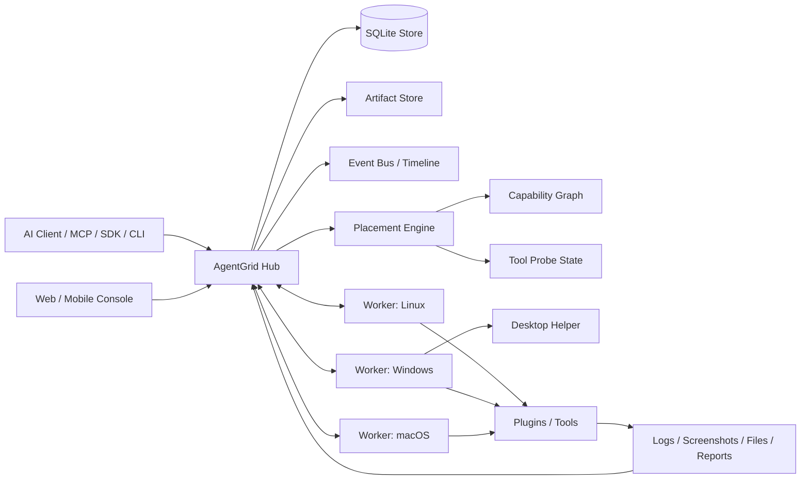

# AgentGrid 架构

AgentGrid 是面向 AI 真实机器操作的 Hub + Worker 运行时。

Hub 负责集群状态、调度决策、Job、任务、产物、用户、组织、工具和审计事件。Worker 运行在可以执行真实操作的机器上。AI 客户端、CLI、SDK、MCP、Web/Mobile 总控台都通过结构化 API 调用 Hub。

## 总体架构

## 运行流程

1. AI 客户端通过 `GET /api/capabilities/manifest` 发现能力。
2. 客户端提交结构化 Task 或 Job。
3. Hub 验证 payload，并生成调度契约。
4. Placement Engine 先按硬约束过滤节点。
5. 再按资源、并发槽位、Probe 状态、历史成功率、权重和风险评分。
6. Worker 获取或接收任务。
7. Worker 执行内置任务类型或插件工具。
8. 输出、证据、产物、指标和审计事件回写 Hub。
9. Web、CLI、SDK、MCP、Webhook、事件流都读取同一份状态。

## 核心模块

| 模块 | 职责 |
| --- | --- |
| `apps/agentgrid-hub` | Rust Hub、HTTP API、数据存储、运行时循环、Web 托管 |
| `apps/agentgrid-worker` | 跨平台 Worker、任务执行、心跳、产物回传 |
| `apps/agentgrid-cli` | 给人和 AI 使用的命令行 |
| `apps/agentgrid-mcp` | MCP Server |
| `apps/agentgrid-web` | Ant Design Pro 总控台 |
| `crates/agentgrid-protocol` | 共享协议类型 |
| `crates/agentgrid-scheduler` | 调度评分和节点选择 |
| `crates/agentgrid-sdk` | Rust SDK |
| `sdk/node` | Node.js SDK |
| `sdk/python` | Python SDK |
| `sdk/mobile` | iOS / Android 控制台 SDK 标准 |

## 关键标准

- AgentMessage：AI Agent 之间的结构化协作消息。
- AgentTask：任务契约。
- Capability Graph：节点、设备、工具、插件、Probe、证据关系模型。
- Execution Contract：输入、输出、错误、超时、重试、产物、审计和指标。
- Evidence Pipeline：截图、日志、文件、报告、串口输出、DOM、时间线。
- Node Join：机器码 + join token + Hub 授权。
- Job Runtime：lease、checkpoint、shard、reducer、恢复。

## 不做什么

- 不把自然语言解析成动作。
- 不替代 AI 客户端。
- 不做通用 RDP / Jenkins / Ansible / CI 替代品。
- 不假设每个节点能力一样。

AgentGrid 是这些系统下面的结构化运行时：它知道真实机器能做什么、任务该去哪里、证据是什么、时间线上发生了什么。

