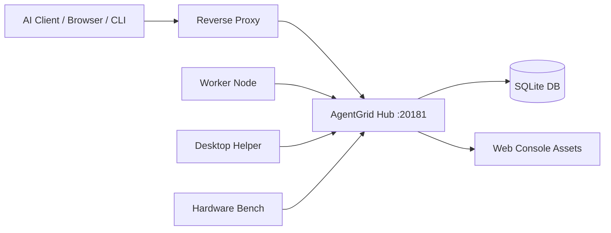

# 部署

这份文档描述一个基础生产部署形态。

## 推荐拓扑



Worker 主动连接 Hub，子节点不需要暴露业务入口。

## 构建发布版本

```bash
cargo build --release -p agentgrid-hub -p agentgrid-worker-app -p agentgrid-cli -p agentgrid-mcp
npm --prefix apps/agentgrid-web install
npm --prefix apps/agentgrid-web run build
```

## Hub 目录结构

```text
/opt/agentgrid-hub/
├── bin/
│   └── agentgrid-hub
├── data/
│   └── agentgrid-hub.db
├── web/
│   ├── index.html
│   └── assets/
└── downloads/
    └── linux-x86_64/
```

## 启动 Hub

```bash
/opt/agentgrid-hub/bin/agentgrid-hub \
  --host 127.0.0.1 \
  --port 20181 \
  --db /opt/agentgrid-hub/data/agentgrid-hub.db \
  --web-dir /opt/agentgrid-hub/web
```

## systemd 示例

```ini
[Unit]
Description=AgentGrid Hub
After=network-online.target
Wants=network-online.target

[Service]
Type=simple
WorkingDirectory=/opt/agentgrid-hub
ExecStart=/opt/agentgrid-hub/bin/agentgrid-hub --host 127.0.0.1 --port 20181 --db /opt/agentgrid-hub/data/agentgrid-hub.db --web-dir /opt/agentgrid-hub/web
Restart=always
RestartSec=3

[Install]
WantedBy=multi-user.target
```

## 反向代理

Nginx 示例：

```nginx
location /agentgrid/ {
    proxy_pass http://127.0.0.1:20181/;
    proxy_http_version 1.1;
    proxy_set_header Host $host;
    proxy_set_header X-Forwarded-Proto $scheme;
    proxy_set_header X-Forwarded-For $proxy_add_x_forwarded_for;
    proxy_set_header Upgrade $http_upgrade;
    proxy_set_header Connection "upgrade";
}
```

## Hub 初始化

1. 打开 Hub 公开地址。
2. 创建唯一 `super_admin`。
3. 把管理员邮箱和密码保存到私有密码管理器。
4. 在系统设置里配置 Hub 访问地址。
5. 如果开启邮箱注册，配置 SMTP。

## SMTP 配置

AgentGrid 支持邮箱验证码注册。

不要把 SMTP 授权码提交到 git。建议通过环境变量或 Hub 系统设置配置。

```bash
AGENTGRID_SMTP_HOST=smtp.example.com
AGENTGRID_SMTP_PORT=465
AGENTGRID_SMTP_USERNAME=agentgrid@example.com
AGENTGRID_SMTP_PASSWORD=replace-me-outside-git
AGENTGRID_SMTP_FROM=agentgrid@example.com
AGENTGRID_SMTP_ENABLED=true
```

## Worker 更新包

Worker 自动更新使用 Hub web 目录下的二进制产物：

```text
web/downloads/<target>/agentgrid-worker
web/downloads/<target>/agentgrid-worker.sha256
```

Windows 使用：

```text
web/downloads/windows-x86_64/agentgrid-worker.exe
```

常用 target：

- `linux-x86_64`
- `linux-x86_64-legacy`
- `darwin-aarch64`
- `darwin-x86_64`
- `windows-x86_64`

## 生产检查清单

- Hub 前面使用 HTTPS。
- 定期备份 Hub 数据库。
- SMTP、SSH、API 密钥不要进 git。
- 限制 Hub 网络访问范围。
- 新 Worker 使用节点入网授权。
- 定期查看审计日志和事件时间线。
- 明确发布 Worker 更新包。
- 不要把无限制命令执行暴露给不可信用户。
